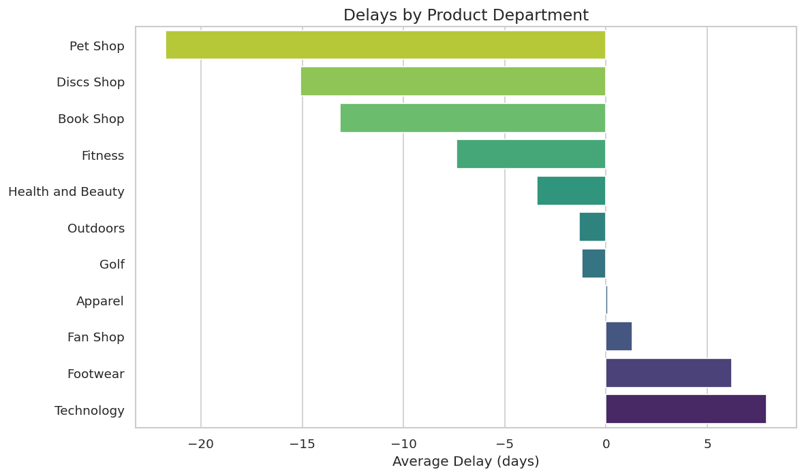
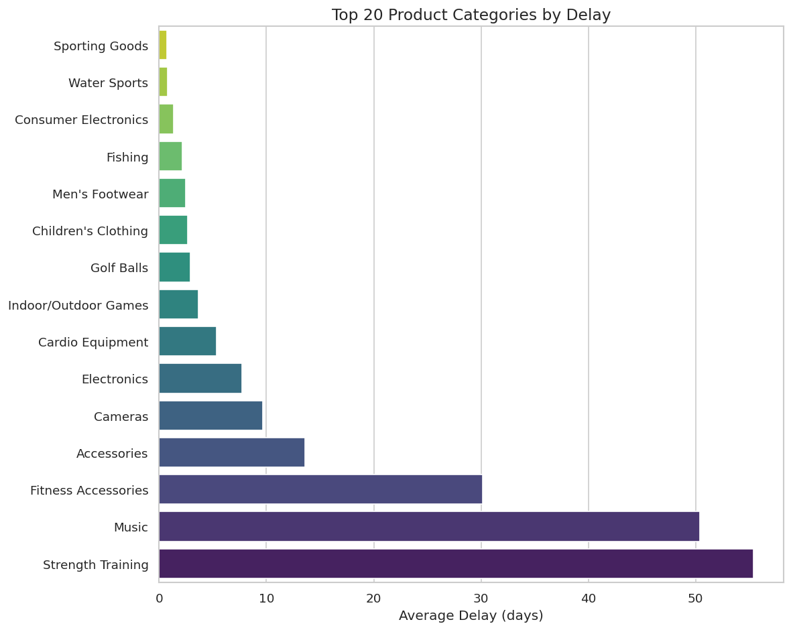
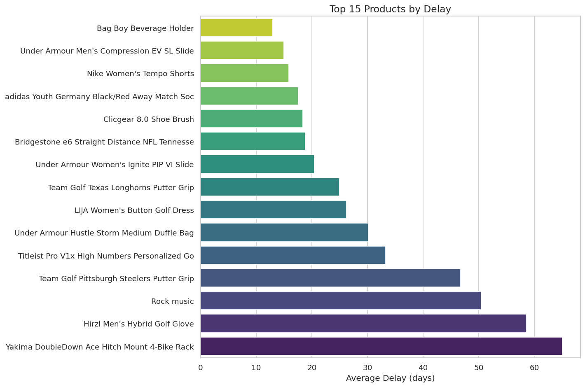
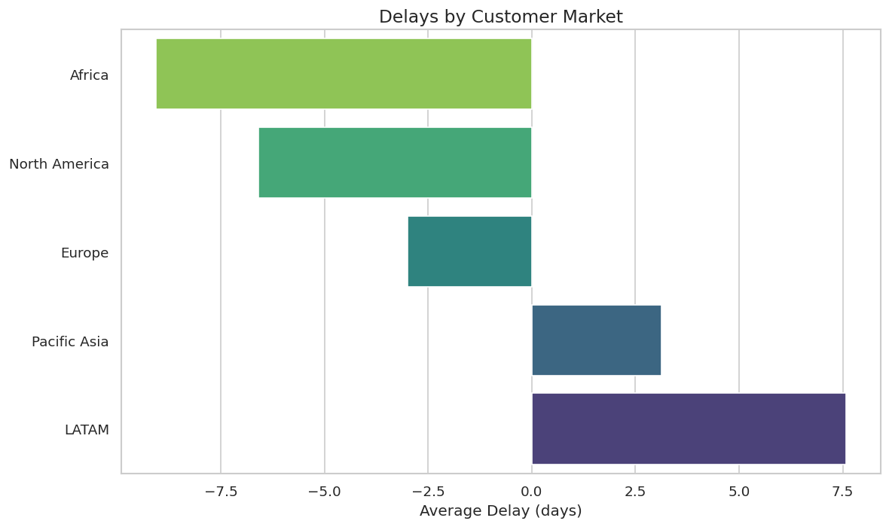
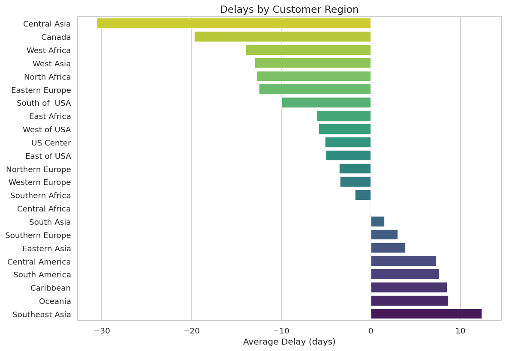
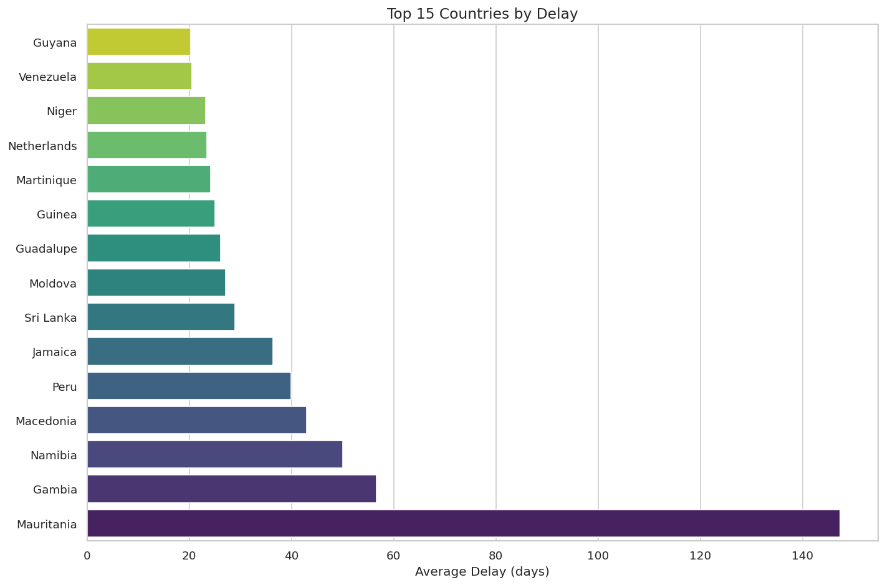
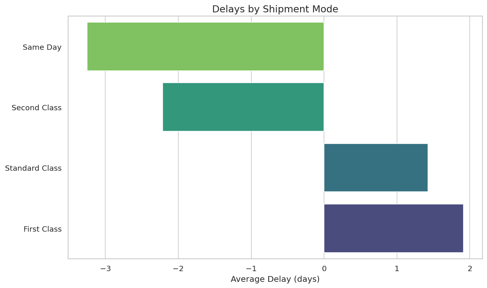
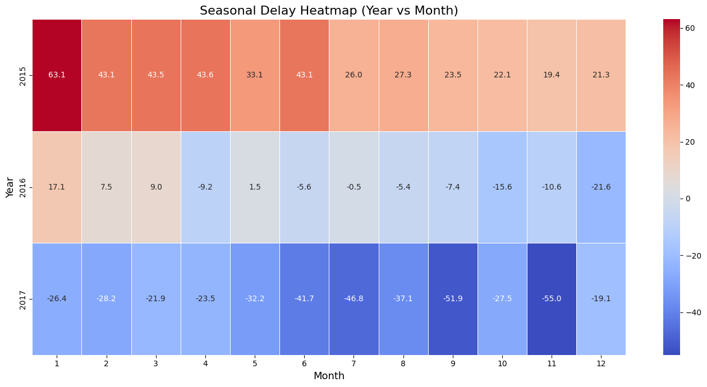
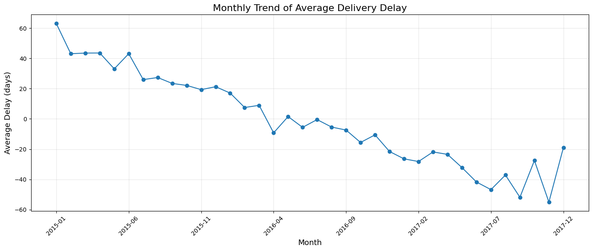
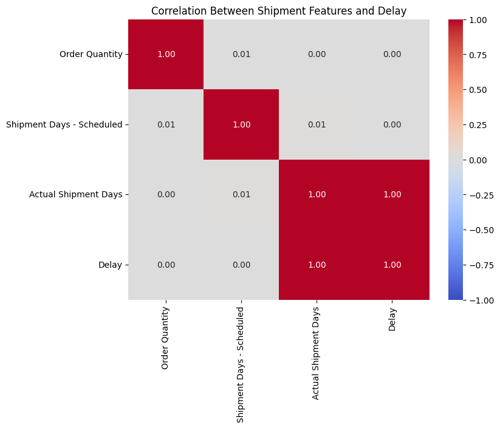

# 📊 Supply Chain Delivery Delay Analysis

The complete analysis of delivery delays across products, regions, shipment
modes, and countries in our global supply chain dataset.  
The analysis uses **real, unmodified delay values**, including early,
 on‑time, and late deliveries.

---

## 🔎 1. Overview of All Analyses

Our work includes **two major analysis sections**:

---

## ✅ A. Standard Delay Analysis (9 Visualizations)

These visualizations explore delays across:

- Product Departments  
- Product Categories  
- Individual Products  
- Customer Markets  
- Customer Regions  
- Customer Countries  
- Warehouse Countries  
- Shipment Modes  
- Global Regions  

All calculations use:

```text
Delay = Actual Shipment Days – Scheduled Shipment Days
Actual Shipment Days = Shipment Date – Order Date
```

---

## ✅ B. Advanced Analysis (Time, Seasonality & Correlation)

This includes:

- Delay Heatmap (Year vs Month)  
- Average Delay by Year  
- Average Delay by Month  
- Month‑to‑Month Trend  
- Correlation Matrix  
- Warehouse → Country Route Delay Map  
- Scheduled vs Actual Days Scatter Plot  

These help identify seasonal patterns, yearly performance changes, and
route‑based issues.

---

## 📊  Standard Analysis Visualizations

### Access to the Netbook [***`data_analysis_notebook.ipynb`***](./data_analysis_notebook.ipynb)

### 1️⃣ Delays by Product Department — Explanation

This chart shows the average delivery delay for each product department.
Technology and Footwear departments experience the highest delays, while
categories like Book Shop, Discs Shop, and Pet Shop often arrive early,
indicating strong operational performance.


### 2️⃣ Delays by Product Category — Explanation

This visualization highlights which product categories face the most delays.
 Strength Training, Music, and Fitness Accessories show major delays, while
 many other categories are close to zero or early, suggesting category-specific bottlenecks.


### 3️⃣ Top 15 Products by Delay — Explanation

This chart identifies specific products with unusually high delays. Items like
 the Yakima Bike Rack, Hirzl Golf Glove, and Rock Music shipments
  have the longest delays, likely due to supply constraints or long-distance sourcing.


### 4️⃣ Delays by Customer Market — Explanation

Latin America shows the highest delays among all markets, while Europe and
North America tend to receive early or on-time deliveries. This highlights
 regional logistical challenges and slower transportation routes for LATAM.


### 5️⃣ Delays by Customer Region — Explanation

Delays vary heavily across regions: Southeast Asia, Oceania, and South America
experience significant delays, whereas North America and Europe typically
receive earlier deliveries. This reflects regional infrastructure and logistical
 differences.


### 6️⃣ Top 15 Countries by Delay — Explanation

Countries such as Mauritania, Gambia, and Namibia have exceptionally high
 delays, sometimes exceeding 100 days. These extreme values may be influenced
  by long distances, customs processes, or regional instability.


### 7️⃣ Delays by Warehouse Country — Explanation

Shipments from Puerto Rico experience consistently higher delays, while
shipments from the USA tend to arrive on time or early. This indicates that
warehouse-level inefficiencies in Puerto Rico may be contributing to global delays.


### 8️⃣ Delays by Shipment Mode — Explanation

Surprisingly, First Class shipments face more delays than Standard or Same-Day
 shipments. Same-day deliveries often arrive early, showing that faster
 shipping modes do not always guarantee fewer delays.


### 9️⃣ Delays by Global Region — Explanation

Oceania, Latin America, and parts of Asia experience the highest delays, while
regions like Africa and North America frequently receive shipments early.
This highlights global inequality in transportation infrastructure.


---

## 🔍 Advanced Analysis Visualizations

### Access to the Netbook [***`advanced_analysis.ipynb`***](./advanced_analysis.ipynb)

### 1️⃣ Average Delay by Year — Explanation

This chart shows that 2015 had heavy delays, 2016 improved significantly, and
 2017 shows early deliveries on average. Overall trend: performance is
 improving year by year.



### 2️⃣ Average Delay by Month — Explanation

Some months (especially earlier in the year) show more delays, while mid-year
months often experience early deliveries. This indicates potential seasonal
cycles in customer demand or supply chain activity.


### 3️⃣ Monthly Trend Line — Explanation

This line chart tracks average monthly delays from 2015 to 2017. It clearly
shows a downward trend, moving from heavy delays toward early deliveries,
 reflecting sustained long-term improvements.


### 4️⃣ World Delay Map — Explanation

This map shows average delivery delays by country. Darker areas indicate
 longer delays, with countries like Mauritania, Gambia, and Namibia
 experiencing the highest delays. Lighter regions, such as North America and
 Europe, show mostly on-time or early deliveries.
  The map highlights where global shipping performance is strongest and
  where major delays occur.


### 5️⃣ Correlation Matrix — Explanation

The correlation matrix shows no strong numerical relationships between delay
and other quantitative variables (order quantity, scheduled days).
 This means delays are influenced more by regions, routes,
 warehouse performance, and external factors rather than internal numeric features.


### 6️⃣ Scheduled vs Actual Shipment Days (Scatter Plot) — Explanation

The scatter plot compares promised vs. actual shipping days. Many points fall
above the diagonal line, showing delays; many fall below, showing early
deliveries. The spread indicates inconsistent shipping performance across
 different orders.


---

## 🧠  Key Findings

### ✔ Product & Category Issues

- Strength Training, Music, and Fitness Accessories have highest delays.  
- Many categories are close to zero delay, showing mixed performance.

### ✔ Geographic Patterns

- LATAM, Oceania, and Central Asia show consistent delays.  
- Some countries experience extreme delays (Mauritania, Namibia, Gambia).

### ✔ Warehouse Performance

- Puerto Rico warehouse shows systemic delays  
- USA warehouse performs significantly better

### ✔ Shipment Modes

- Same‑Day often early  
- First Class sometimes late  
- Fast shipping ≠ reliable shipping

### ✔ Route‑Based Delays

Certain warehouse → country paths repeatedly show long delays.

### ✔ Seasonal Insights

- 2015: Severe delays  
- 2016: Mild delays  
- 2017: Mostly early deliveries  
- Monthly seasonality shows delays peak early in the year

### ✔ Correlation

No strong numeric correlation was found between delay and quantity,
 scheduled days, etc.

---

## 🛑  Why These Delays Happen (Likely Factors)

- International distance  
- Customs and border control  
- Warehouse inefficiencies  
- Supplier delay  
- Regional infrastructure limitations  
- Seasonal demand spikes  
- Political & socio‑economic instability in certain countries  

---

## 🚀 Suggested Improvements

- Upgrade Puerto Rico warehouse operations  
- Optimize routing for LATAM, Oceania, Central Asia  
- Expand regional warehousing  
- Improve supplier coordination  
- Implement predictive analytics to forecast delays  
- Seasonal planning (Q1 is high‑risk)  

---
