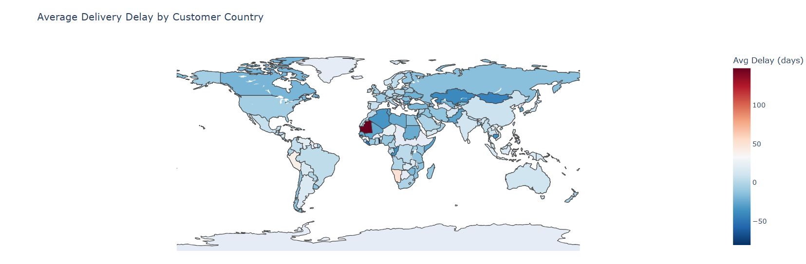
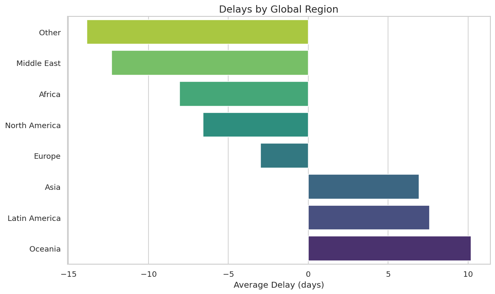
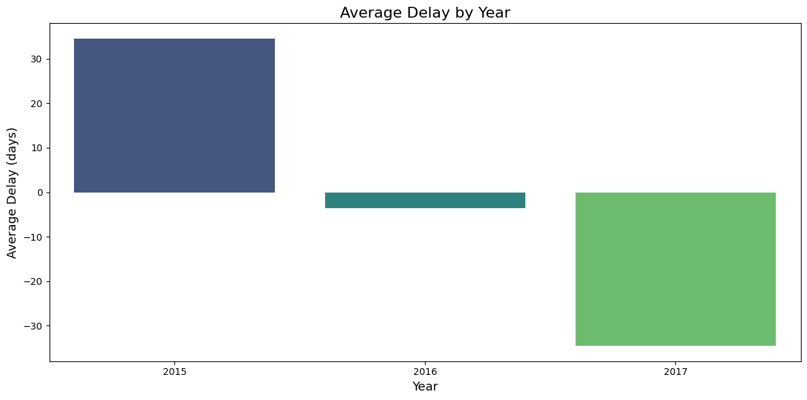

# 👋 Welcome to Global Supply Chain Visualization

## 

In this project, we explore the journey of products across the **global supply
 chain** and visualize where delays occur.  
The goal is to make it easy to understand **which routes, product types,
regions, or shipment modes** are more likely to experience delays — helping
analysts and businesses make better operational decisions.

---

## 🎯 Project Overview

Global supply chains are complex networks connecting warehouses, transportation
 systems, customs processes, and last-mile delivery.  
Delays can occur at many stages due to distance, transit times,
warehouse efficiency, shipping modes, and political or logistical conditions.

This project uses data visualization to:

- Highlight **patterns of delay**
- Identify **high-risk regions and products**
- Reveal **inefficiencies in warehouse-to-country routes**
- Show **seasonal and yearly performance trends**

Our analysis gives a clear, data-driven picture of where and why delays happen.

---

## ❓ Main Research Question

**How can data visualization reveal delay risks across different stages of the
 global supply chain?**

---

## 📝 Background

Global supply chains involve multiple steps:

- Warehouse operations  
- International shipping  
- Customs and border clearance  
- Domestic transportation  
- Final delivery  

---

## 📈 Key Visualizations (High-Level Summary)

Below are the **four most important visualizations** from our analysis.  
These give readers a quick understanding of the global delay landscape.

---

## 🌍 **1. World Delay Map**

This map shows average delivery delays across countries.  
Dark regions represent **higher delays**, especially in Mauritania, Gambia,
 Namibia, and parts of South America.
Europe and North America show mostly early or on-time deliveries.

📌 *Insight:*  

**Delays vary significantly across the globe, with certain countries experiencing
 extremely long shipping times due to distance, customs, or regional constraints.**

---

## 🌎 **2. Global Region Delay Chart**

This chart compares delays across major world regions.  
Oceania, Latin America, and parts of Asia show the highest delays, while Africa
 and North America frequently receive early deliveries.

 📌 *Insight:*

**Regional logistics infrastructure heavily influences delivery times.**

---

## 🗺️ **3. Warehouse → Country Route Heatmap**

This visualization shows delays for each warehouse-to-country route.  
Puerto Rico consistently shows higher delay routes, whereas the USA routes are
 more stable.

 📌 *Insight:*  

**Warehouse location is a major factor — Puerto Rico is a clear bottleneck.**

---

## 📆 **4. Yearly Delay Trend**

This chart shows average delays by year:  

- 2015: Heavy delays  
- 2016: Marked improvement  
- 2017: Mostly early deliveries  

 📌 *Insight:*  

**The supply chain improved significantly over time, showing increased
efficiency year by year.**

---

## 🧠 Summary of Findings

### ✔ Product-Level Insights

- Strength Training, Music, and Fitness Accessories show the highest delays.  
- Many other categories are consistently early.

### ✔ Geographic Insights

- LATAM, Oceania, and Central Asia face significant delays.  
- Europe and North America perform reliably.

### ✔ Country-Level Highlights

- Countries like Mauritania, Gambia, Peru, and Namibia experience extreme delays
   (100+ days).
- These may be influenced by distance, customs procedures, or political factors.

### ✔ Warehouse Performance

- **Puerto Rico has major delays.**  
- **USA warehouses perform significantly better.**

### ✔ Shipment Mode Insights

- Same-Day shipments often arrive early.  
- First Class is surprisingly less reliable.

### ✔ Seasonal & Yearly Trends

- Early 2015 had heavy delays.  
- Shipping performance improved steadily through 2017.

---

## 🛑 Why These Delays Occur (Interpretation)

Based on patterns seen in the data:

- **Long shipping distances** increase delays  
- **Customs and regulatory processes** slow down specific regions  
- **Warehousing inefficiencies** add bottlenecks  
- **Supplier constraints** affect certain product categories  
- **Political or economic instability** affects some countries  
- **Seasonal demand spikes** (e.g., early year) increase load on logistics  

---

## 🚀 Suggested Improvements

- Optimize routes for LATAM and Oceania  
- Improve warehouse processes — especially Puerto Rico  
- Establish regional warehouses  
- Collaborate closer with suppliers  
- Use predictive analytics to prevent known delay risks  
- Plan for seasonal peaks  

---

## ✅ Conclusion

This project demonstrates how **data visualization makes global supply chain
performance easy to understand**.  
By examining products, regions, shipment modes, routes, and time-based trends,
 we identified exactly **where delays occur and why**.

Our findings directly support our main research question:

> **Data visualization reveals delay risks by exposing patterns that aren’t
visible in raw data — helping organizations target the exact segments of the
supply chain that need improvement.**
