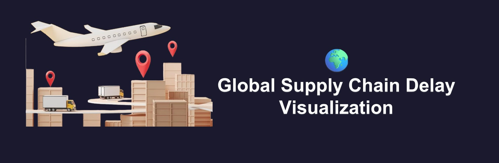

# 👋 Welcome to Global Supply Chain Visualization

## 

In this project, we explore the journey of products across the
**global supply chain** and visualize where delays happen.
The goal is to make it easy to understand **which routes, product types,
or shipment modes** are more likely to experience delays, helping analysts and
 businesses make better decisions.

---

## 🎯 Project Overview

Global supply chains are complex networks that move products from warehouses to
 customers around the world. Delays can occur at many stages, affecting
 efficiency, costs, and customer satisfaction.  

This project uses data visualization to **map the journey of products**,
highlight **potential delay risks**, and reveal **patterns that are not
immediately obvious** from raw data.  

---

## ❓ Main Research Question

**How can data visualization reveal delay risks across different stages
of the global supply chain?**

---

## 📝 Background

Global supply chains involve multiple stages — warehouse handling
 transportation, and final delivery. Each stage is subject to delays due to
 factors like distance, shipment mode, product type, or seasonality.  

Visualizing these delays helps organizations quickly identify bottlenecks,
understand patterns, and take proactive actions to improve efficiency.  

---
Explore the visualizations to see **global shipment routes, delay risks by
region, and insights into product journeys** across the world.
